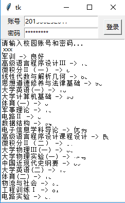

### 简述
- 使用mnist_cnn模型识别正方教务系统验证码模拟登录获取历年成绩
- web_app 与 tk_ui 两种简单封装
- 使用python3, keras, tensorflow
- 详见 [简书](http://www.jianshu.com/p/479dff9a599d)

### 训练
- train_pictures文件夹内为训练集图片
- `python cnn_dama.py`训练生成模型

### 效果
- `python tk_ui.py`
